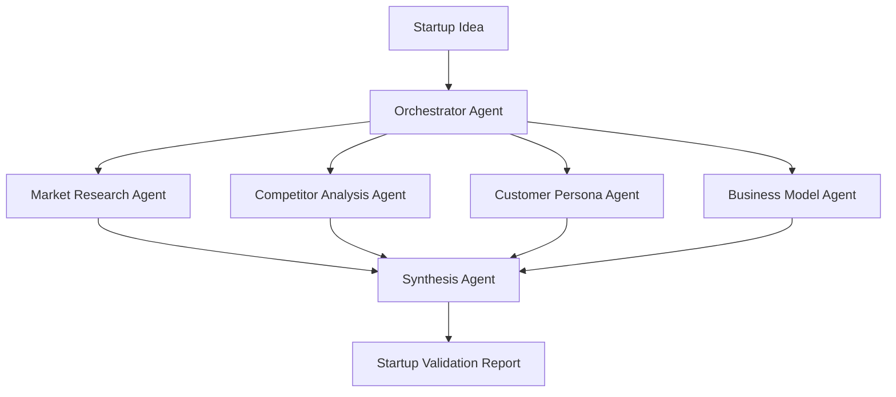
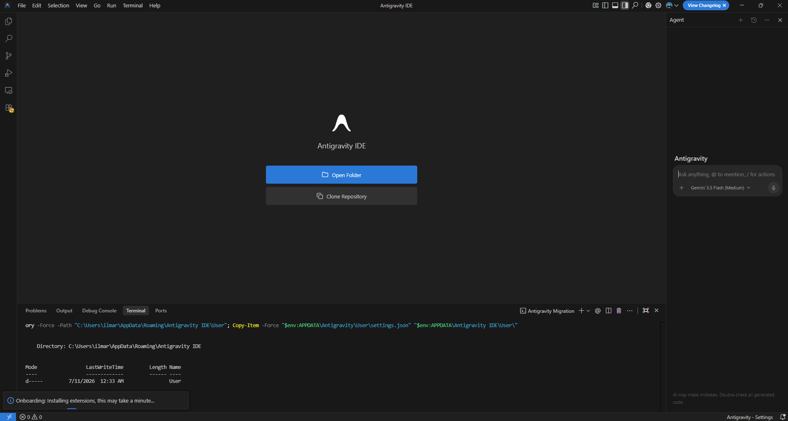
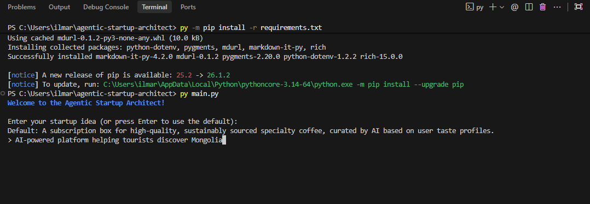
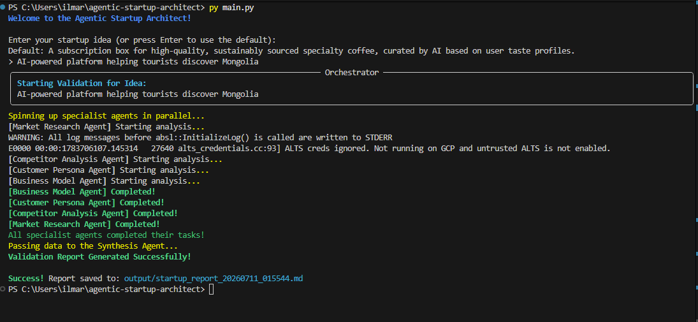

🏆 Built for Google Agentic Architect Sprint 2026

# Agentic Startup Architect

A multi-agent startup validation system built with Google Antigravity and Gemini.

This project was created for the **Agentic Architect Sprint 2026** and demonstrates **Dynamic Subagents & Shared Agent Harness** for startup evaluation and business validation workflows.

---

## Overview

Startup validation often requires multiple types of analysis, including market research, competitor analysis, customer discovery, and business model evaluation.

Instead of relying on a single AI agent, Agentic Startup Architect decomposes the problem into specialized agents that operate independently and contribute their findings to a final recommendation report.

The system showcases:

- Dynamic Subagents
- Shared Agent Harness
- Context Isolation
- Parallel Execution
- Multi-Agent Orchestration
- Reasoning-Driven Decision Making

---

## Architecture



---

## Demo

### Input

```text
AI-powered platform helping tourists discover Mongolia
```

### Workflow

```text
1. Orchestrator Agent receives startup idea
2. Market Research Agent analyzes market opportunity
3. Competitor Analysis Agent evaluates competitors
4. Customer Persona Agent identifies target users
5. Business Model Agent assesses viability
6. Synthesis Agent generates final recommendation
```

### Output

```text
Verdict: GO

Confidence Score: 82%

Key Opportunities:
- Offline-first travel assistant
- Localized tourism intelligence

Key Risks:
- Seasonality
- Customer acquisition cost
```


## Screenshots

### Antigravity IDE



The project was developed using Google Antigravity IDE and Gemini-powered agent workflows. Antigravity was used to assist with architecture design, implementation planning, technical analysis, and documentation.

### Parallel Agent Execution



### Startup Validation Report



## How Google Antigravity Was Used

Google Antigravity was used throughout the project lifecycle:

- Architecture design
- Multi-agent workflow planning
- Agent orchestration design
- Technical analysis
- Code generation assistance
- Documentation creation

The project specifically explores Dynamic Subagents & Shared Agent Harness patterns using Antigravity-assisted development.

## Agent Responsibilities

### Market Research Agent

Responsible for:

- TAM / SAM / SOM estimation
- Market trends
- Growth opportunities
- Market risks

### Competitor Analysis Agent

Responsible for:

- Competitor discovery
- Competitive positioning
- SWOT analysis
- Unique Value Proposition identification

### Customer Persona Agent

Responsible for:

- Target audience definition
- Pain point analysis
- Customer goals
- Acquisition opportunities

### Business Model Agent

Responsible for:

- Revenue streams
- Cost structure
- Unit economics
- Financial viability

### Synthesis Agent

Responsible for:

- Aggregating outputs from all specialist agents
- Producing a final startup validation report
- Generating strategic recommendations
- Providing a Go / No-Go decision

---

## Shared Agent Harness

The project follows a Hub-and-Spoke architecture.

The Shared Agent Harness is provided by:

### BaseAgent

A shared agent framework that handles:

- Gemini API communication
- Model configuration
- Error handling
- Prompt execution

### Orchestrator Agent

The orchestrator:

- Creates and manages specialist agents
- Coordinates execution
- Collects outputs
- Routes findings to the Synthesis Agent

This architecture minimizes duplicated logic and makes it easy to add new specialist agents.

---

## Context Isolation

Each specialized agent receives only the original startup idea.

For example:

- Market Research Agent does not see Competitor Analysis results.
- Competitor Analysis Agent does not see Customer Persona outputs.
- Business Model Agent does not see Market Research assumptions.

This isolation prevents cascading biases and allows every agent to independently reason about its assigned domain.

Only the Synthesis Agent receives full visibility into all outputs.

---

## Parallel Execution

The system executes specialist agents concurrently using asynchronous execution.

Instead of running sequentially:

```text
Market Research
→ Competitor Analysis
→ Customer Persona
→ Business Model
```

all agents execute at the same time:

```text
Market Research Agent
Competitor Analysis Agent
Customer Persona Agent
Business Model Agent
```

The Orchestrator waits for all results and then forwards them to the Synthesis Agent.

Benefits include:

- Reduced latency
- Better resource utilization
- Improved scalability
- Faster startup validation

---

## Example Startup

```text
AI-powered platform helping tourists discover Mongolia
```

---

## Example Output

### Market Opportunity

Growing tourism demand and increasing interest in personalized travel planning experiences.

### Competitors

- Tripadvisor
- Google Travel
- GetYourGuide

### Customer Personas

- Adventure Travelers
- Digital Nomads
- Family Tourists

### Business Model

- Booking commissions
- Premium subscriptions
- Partner marketplace fees

### Final Recommendation

```text
GO

Confidence Score: 82%
```

---

## Technical Highlights

- Multi-Agent Architecture
- Dynamic Subagents
- Shared Agent Harness
- Context Isolation
- Parallel Execution
- Gemini-Powered Analysis
- Structured Startup Evaluation

---

## Agentic Architect Sprint 2026

### Project Topic

**Dynamic Subagents & Shared Agent Harness**

### Project Title

**Agentic Startup Architect: Multi-Agent Business Validation using Google Antigravity**

This project demonstrates how specialized AI agents can collaborate to perform startup validation through parallel execution and structured reasoning.

---

## Future Work

- Fully Autonomous Goal Execution
- Human-in-the-Loop Approval Gates
- Continuous Market Monitoring
- Persistent Memory Between Agents
- Agent Performance Evaluation Framework
- Web Interface and Visualization Dashboard

---

## Getting Started

### Clone Repository

```bash
git clone https://github.com/BilguunGDE/agentic-startup-architect.git
cd agentic-startup-architect
```

### Install Dependencies

```bash
pip install -r requirements.txt
```

### Configure Environment

Create a `.env` file:

```env
GEMINI_API_KEY=your_api_key_here
```

### Run

```bash
python main.py
```

## Technologies

- Google Antigravity
- Gemini
- Python
- AsyncIO
- GitHub

## Related Links

- Blog Post: https://medium.com/@bilguun.js/building-a-multi-agent-startup-validation-system-with-google-antigravity-314aa60a2f02?sharedUserId=bilguun.js
---

## License

MIT License

[images]: images/ide.png